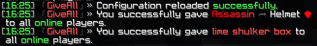
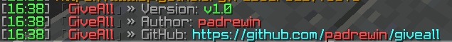

# GiveAll

● A **Minecraft** plugin that allows you to give to all online players **an item** you're holding in your main hand.


- Here you can mainly configurate messages displayed within the plugin that will be shown for yourself / to players.
```yaml
# Default configuration file for the GiveAll plugin

messages:
  # Tag prefix that will be added to the beginning of all plugin messages
  tag: "&8「&#CB2D3EG&#D1313Di&#D7363Dv&#DD3A3Ce&#E33E3BA&#E9433Bl&#EF473Al&8」&7»&f "

  # Message displayed when a player does not have permission to use the /giveall command
  no_permission: "&cYou don't have permissions to use /giveall!"

  # Message displayed when a non-player entity tries to use the /giveall command
  only_players: "&cSorry! Only players can use /giveall!"

  # Message displayed when a player tries to use /giveall without holding an item
  no_item_in_hand: "&fYou must hold an item in hand in order to use this command."

  # Message sent to all players when the /giveall command is used successfully
  # {player} will be replaced by the name of the player who used the command
  # {item} will be replaced by the name of the item given
  give_message: "&c{player} &fhas given everyone &c{item}&f!"

  # Message displayed to the player who used the /giveall command to confirm the item was given
  # {item} will be replaced by the name of the item given
  item_given: "&fYou successfully gave &c{item} &fto all &aonline &fplayers."

  # Message displayed when the configuration file is reloaded successfully using /giveall reload
  config_reloaded: "&fConfiguration reloaded &asuccessfully&f."
```


```yaml
permissions:
  giveall.use:
    description: Allows the player to use the /giveall command.
    default: op
  giveall.reload:
    description: Allows the player to reload the plugin configuration.
    default: op
  giveall.version:
    description: Allows the player to view the plugin version information.
    default: op
```

● This **plugin** is now updated to v2.0 in order to be able to use HEX color codes.



